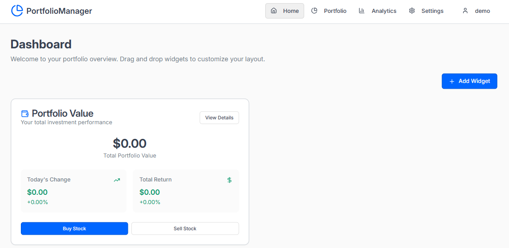
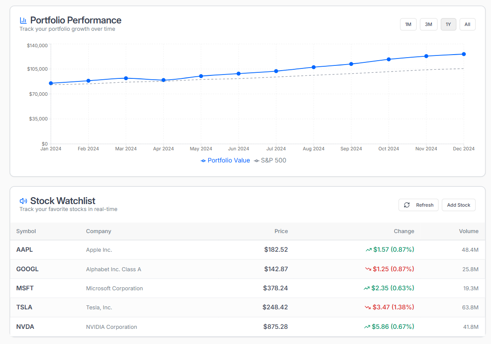
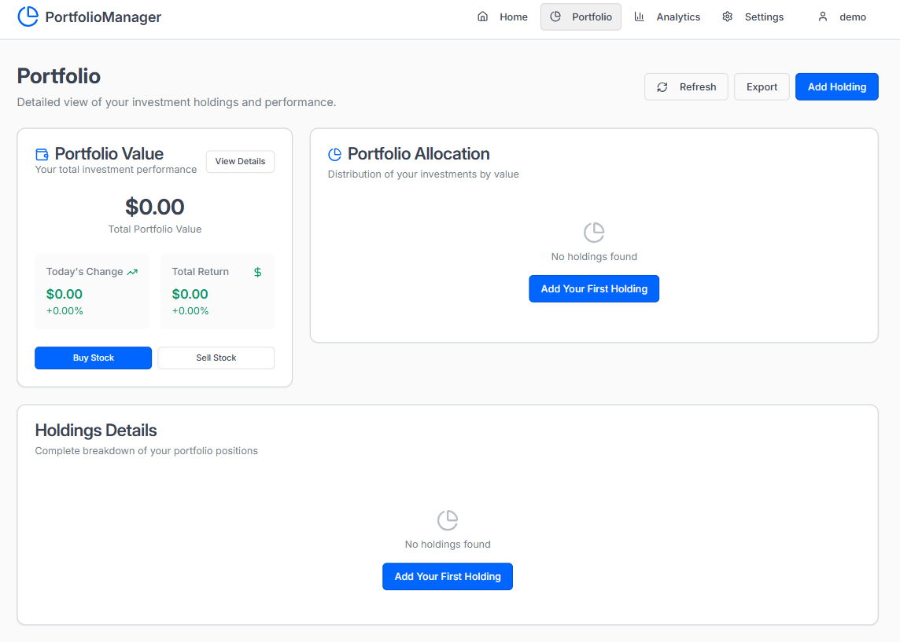
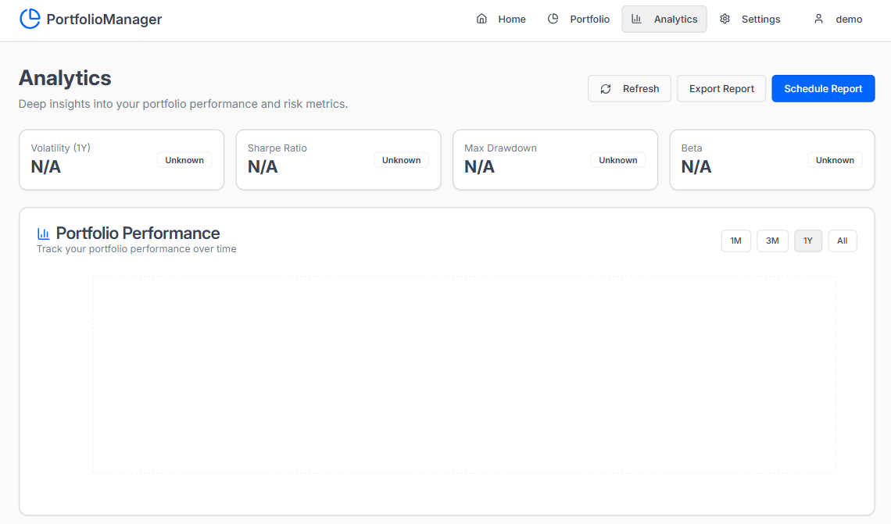
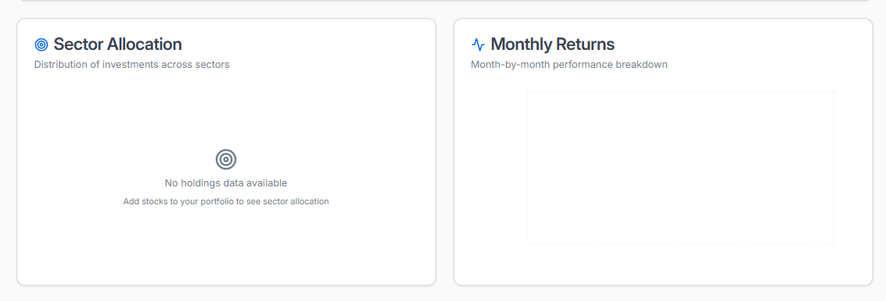
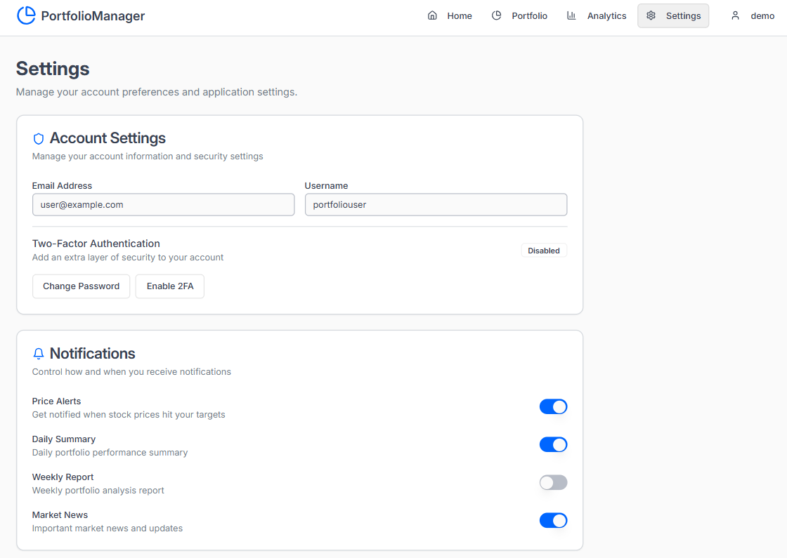
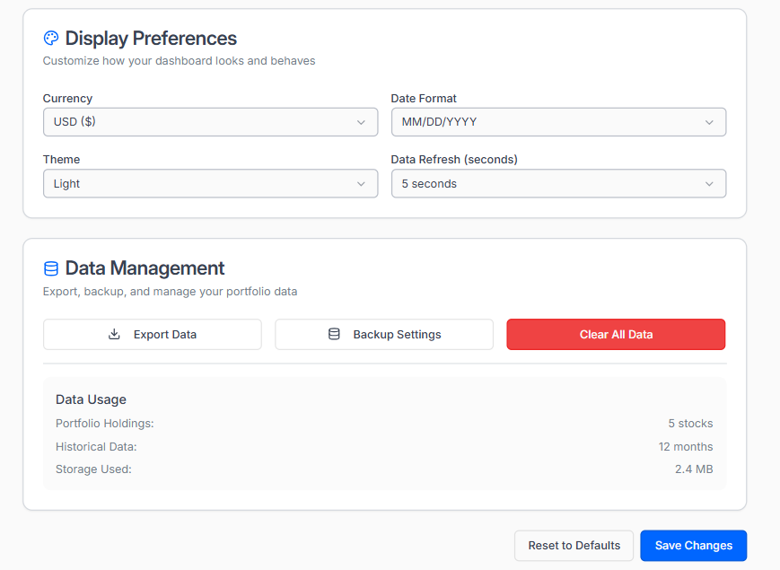
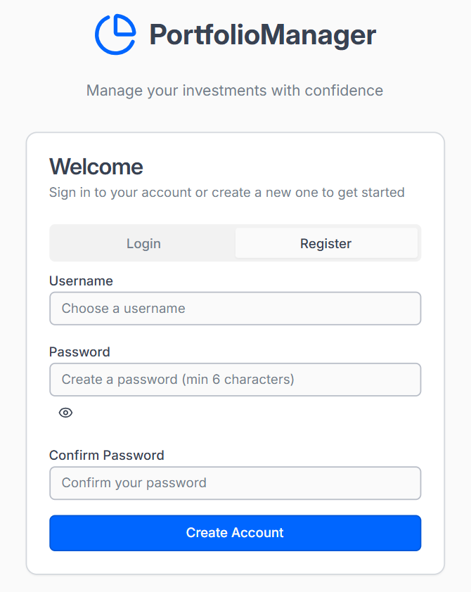

# 📈 Smart Portfolio Manager

> **Manage your investments with confidence**

A comprehensive, modern portfolio management application that helps you track, analyze, and optimize your investment portfolio with real-time data and advanced analytics.

[](https://github.com/shivoshita/SmartPortfolioManager/blob/main/LICENSE)
[](https://github.com/shivoshita/SmartPortfolioManager/stargazers)
[](https://github.com/shivoshita/SmartPortfolioManager/network)
[](https://github.com/shivoshita/SmartPortfolioManager/issues)

## ✨ Features

🔹 **Real-time Portfolio Tracking** - Monitor your investments with live market data  
🔹 **Advanced Analytics** - Deep insights with volatility, Sharpe ratio, and risk metrics  
🔹 **Interactive Dashboard** - Clean, intuitive interface for easy portfolio management  
🔹 **Stock Watchlist** - Track your favorite stocks in real-time  
🔹 **Performance Visualization** - Beautiful charts and graphs for trend analysis  
🔹 **Portfolio Allocation** - Visual breakdown of your investment distribution  
🔹 **Custom Notifications** - Price alerts and daily/weekly reports  
🔹 **Secure Authentication** - Two-factor authentication support  
🔹 **Data Export** - Export your portfolio data for external analysis  

## 🖼️ Screenshots

### Dashboard

*Main dashboard showing portfolio overview and key metrics*

### Portfolio Performance

*Track your portfolio growth over time with comparative analysis against S&P 500*

### Portfolio Management

*Detailed view of your investment holdings and performance metrics*

### Analytics

*Advanced analytics dashboard with risk metrics and performance indicators*

### Sector Allocation & Monthly Returns

*Sector distribution and monthly performance breakdown*

### Settings - Account Management

*Comprehensive settings for account management and notifications*

### Settings - Display Preferences

*Customizable display preferences and data management options*

### User Authentication

*Secure login and registration system*

## 🚀 Getting Started

### Prerequisites

- Node.js (v16 or higher)
- npm or yarn
- Modern web browser

### Installation

1. **Clone the repository**
   ```bash
   git clone https://github.com/shivoshita/SmartPortfolioManager.git
   cd SmartPortfolioManager
   ```

2. **Install dependencies**
   ```bash
   npm install
   # or
   yarn install
   ```

3. **Set up environment variables**
   ```bash
   cp .env.example .env
   ```
   Edit `.env` with your configuration:
   ```env
   REACT_APP_API_KEY=your_api_key_here
   REACT_APP_BASE_URL=http://localhost:3000
   DATABASE_URL=your_database_url
   ```

4. **Start the development server**
   ```bash
   npm start
   # or
   yarn start
   ```

5. **Open your browser**
   Navigate to `http://localhost:3000`

## 🏗️ Tech Stack

- **Frontend**: React.js, TypeScript
- **UI Library**: Material-UI / Tailwind CSS
- **Charts**: Chart.js / Recharts
- **Authentication**: JWT, 2FA support
- **API**: RESTful API with real-time data
- **Database**: PostgreSQL / MongoDB
- **Deployment**: Docker, AWS/Vercel

## 📊 Key Metrics Tracked

- **Portfolio Value**: Real-time total portfolio valuation
- **Daily/Total Returns**: Performance tracking with percentage changes
- **Volatility**: Risk assessment metrics
- **Sharpe Ratio**: Risk-adjusted return calculations
- **Max Drawdown**: Downside risk analysis
- **Beta**: Market correlation analysis
- **Sector Allocation**: Investment diversification tracking

## 🔧 Configuration

### API Configuration
Configure your preferred data provider in the settings:
- Alpha Vantage
- Yahoo Finance
- IEX Cloud
- Finnhub

### Notification Settings
Customize your notification preferences:
- Price alerts when stocks hit target prices
- Daily portfolio summary emails
- Weekly analysis reports
- Market news updates

## 🔒 Security Features

- **Two-Factor Authentication** (2FA)
- **Secure Password Requirements** (minimum 6 characters)
- **Data Encryption** for sensitive information
- **Session Management** with automatic logout
- **Backup & Export** capabilities

## 📈 Portfolio Analytics

The analytics dashboard provides comprehensive insights:

- **Risk Metrics**: Volatility, Beta, Max Drawdown
- **Performance Metrics**: Sharpe Ratio, Alpha, Total Return
- **Sector Analysis**: Distribution across different sectors
- **Monthly Returns**: Performance breakdown by month
- **Comparative Analysis**: Benchmark against S&P 500

## 🛠️ API Endpoints

```
GET    /api/portfolio          # Get portfolio summary
POST   /api/portfolio/holdings # Add new holding
PUT    /api/portfolio/holdings/:id # Update holding
DELETE /api/portfolio/holdings/:id # Remove holding
GET    /api/analytics         # Get portfolio analytics
GET    /api/watchlist         # Get watchlist stocks
POST   /api/auth/login        # User authentication
POST   /api/auth/register     # User registration
```

## 🤝 Contributing

We welcome contributions! Please follow these steps:

1. Fork the repository
2. Create a feature branch (`git checkout -b feature/AmazingFeature`)
3. Commit your changes (`git commit -m 'Add some AmazingFeature'`)
4. Push to the branch (`git push origin feature/AmazingFeature`)
5. Open a Pull Request

### Development Guidelines

- Follow the existing code style
- Write tests for new features
- Update documentation as needed
- Ensure all tests pass before submitting PR

## 📝 License

This project is licensed under the MIT License - see the [LICENSE](LICENSE) file for details.

## 🙏 Acknowledgments

- Market data provided by various financial APIs
- Icons and graphics from Material-UI and Lucide React
- Community contributors and feedback

## 📞 Support

If you encounter any issues or have questions:

- 📧 Email: support@smartportfoliomanager.com
- 🐛 Issues: [GitHub Issues](https://github.com/shivoshita/SmartPortfolioManager/issues)
- 💬 Discussions: [GitHub Discussions](https://github.com/shivoshita/SmartPortfolioManager/discussions)

## 🌟 Star History

[](https://star-history.com/#shivoshita/SmartPortfolioManager&Date)

---

<div align="center">
  <strong>Made with ❤️ by <a href="https://github.com/shivoshita">@shivoshita</a></strong>
  <br>
  <em>Happy Investing! 📈</em>
</div>
